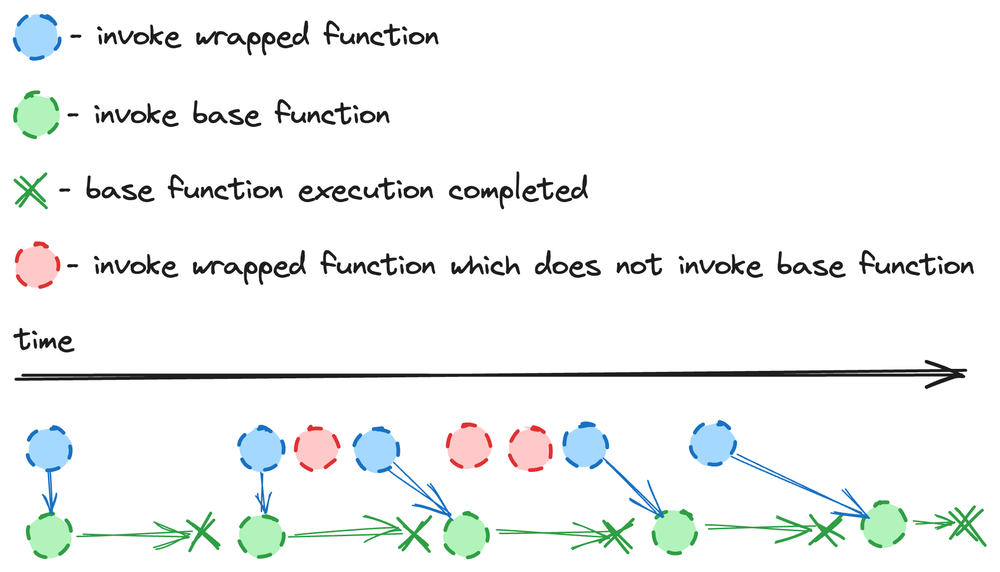

### High Order Function for Async Function Wrapping

This high-order function wraps an asynchronous function to
ensure controlled execution. When the wrapped function
is invoked, it starts executing immediately if it's the 
first call. However, if the function is called multiple
times before the first execution completes, only the last
call will be executed once the first execution finishes.
This mechanism ensures that no parallel executions occur,
and redundant calls are ignored until the initial
execution is complete.

```typescript
async function base(params): Promise<void> {
    ...
}
const wrapped = invokeInSequenceOnlyTheFirstAndLast(base)
```


